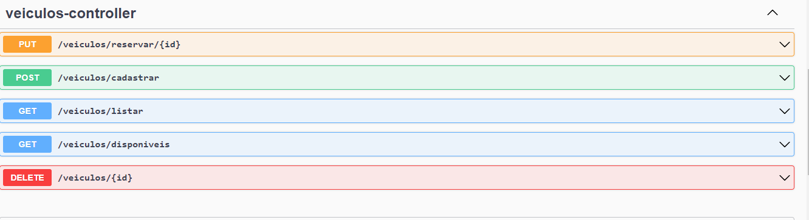

# Aplicação de Gerenciamento de Veiculos

Um a aplicação de gerenciamento de veiculos, desenvolvido com Spring Boot no backend e Angular no frontend. Permite cadastrar e remover veículos, fazer reservas e buscar carros disponíveis. Este repositório contém o código fonte do backend e do frontend. Recomendo abrir um em cada arquivo, pois é necessário rodar ambos ao mesmo tempo, para que se possa ver a API completa. Essa API tem como proposito o gerenciamento de uma loja que realiza alugueis de veículos, e se encontrava em necessidade de um gerenciador de veículos e reservas.

## Instalação

1. Clone o repósitorio para o seu ambiente de trabalho.

2. Navegue até o seu repósitorio recém baixado.

## A Configuração do Ambiente

3. Na IDE, com sua aplicação, abra o terminal e dê um NPM INSTALL, para que todos os pacotes possam ser baixados.

## Uso

4. Caso queira ver as rotas em acão, primeiramente, é necessário iniciar sua aplicação. Recomendo o uso do plug-in Spring Boot DashBoard, caso estejam usando Visual Studio Code, ele permite rodar apenas com um clique. ALém disso, recomendo também o uso do Swaddle, uma vez que rodar em sua máquina, entrando pela URL:
   http://localhost:8080/swagger-ui/index.html#/veiculos

Será possivel observar as rotas, no entanto, devido a problemas técnicos, estão presentes outras rotas, mantenha o foco nas rotas do veiculos-controller.

## Configuração

5. É necessário a configuração do Banco de Dados, dentro da pasta src/main/resources, você irá encontrar um arquivo chamado application.properties, é um arquivo que contem a configuração do seu banco de dados. Essa aplicação, necessita apenas que você entre em sua conta, por meio do nome de usuario e sua senha, paa que possa rodar.

   spring.datasource.url=jdbc:mysql://localhost:3306/gerenciamento_veiculos

Você pode trocar o nome da sua database, é apenas trocar o 'gerenciamento_veiculos' do trecho acima, pelo nome da sua escolha. Não é necessário a crianção das colunas, pois a aplicação cria sozinha, uma vez rodando.

    spring.datasource.username=seuUsername
    spring.datasource.password=suaSenha

Ainda no arquivo application.properties, é de extrema importância que ocorra o login, para que assim seja possivel a manipulação da tabela por meio da aplicação.

## API

A API possui 5 Endpoints. O primeiro endpoint - o DELETE /veiculos/{id}, que permite que sejam apagados os veiculos, e se observarem no swaddle ou através do insomnia, são excluidos apenas aqueles que não possuem uma reserva em seu nome.
O segundo Endpoint é o POST /veiculos/cadastrar, que permite que sejam cadastrados automoveis, com Modelo, Marca, Cor, Ano de Fabricação, Placa e Reservado, o Id não pode ser cadastrado pois ele se auto-incrementa.
O terceiro Endpoint é o GET /veiculos/listar, que permite que todos os veiculos cadastrados sejam apresentados.
O quarto Endpoint é o GET /veiculos/disponiveis, que permite que o usuário encontre apenas aqueles veiculos que não es~tao reservados.
O quinto Endpoint é o PUT /veiculos/reservar/{id}, que permite que quando especificado essa URL, com o Iddesejado, seja feito uma reserva, de forma em que reservado = False vire reservado = True, recomendo o insomnia para esse teste.

Essa aplicação foi feita com Spring Boot e Java,e é o Back End, com a realização de diversas rotas. Optei por utilizar apenas uma tabela, com 'reservado' sendo um boolean, de modo em que fosse mais direta a aplicação.

;
